  

---

## Über mich

Ich interessiere mich für IT und dafür, wie Software und Computersysteme funktionieren.

Bisher habe ich mich vor allem mit Programmierung und Webentwicklung beschäftigt.
Aktuell erweitere ich meine Kenntnisse im Bereich **Systemintegration und IT-Infrastruktur**.

Ich lerne gerne durch praktische Übungen und eigene Projekte und möchte meine Kenntnisse Schritt für Schritt erweitern.

---

## Kenntnisse

### Programmiersprachen

### Webentwicklung

### Tools

---

## Aktuell

Ich erweitere derzeit meine Kenntnisse im Bereich **Systemintegration**.

| Bereich | Aktueller Fokus |
|:---|:---|
| Systeme | Betriebssysteme & Administration |
| Netzwerk | Grundlagen & Kommunikation |
| Server | Grundlagen der Serveradministration |
| Sicherheit | Grundlagen der IT-Sicherheit |
| Automatisierung | Scripting & praktische Übungen |

Ich möchte das Gelernte Schritt für Schritt praktisch anwenden und dabei neue Erfahrungen sammeln.

---

## Projekte

Hier dokumentiere ich eigene Projekte, Übungen und technische Experimente.

Mit der Zeit werde ich diesen Bereich mit weiteren Projekten aus
der Softwareentwicklung und Systemintegration ergänzen.

---

## Kontakt

[GitHub](https://github.com/iboAb)

---

  Danke fürs Vorbeischauen.

